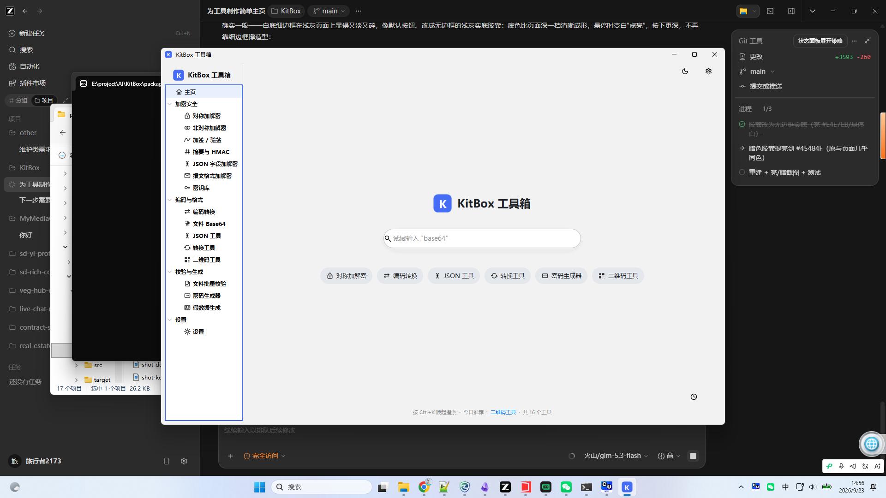

# KitBox 工具箱

带可视化窗口的本地工具箱（加解密 / 编码 / 二维码 / 密钥管理），基于 **Java Swing + FlatLaf + BouncyCastle + ZXing**，单 jar 运行，完全离线。

 

## 运行

```bash
# 构建（含单元测试）
mvn package

# 运行
java -jar target/KitBox.jar
```

要求本机安装 JDK 8 或更高版本。

### 免安装分发包（Windows）

不想装 Java？可用 `packaging/package.ps1` 一键打出**自带精简 JRE 的免安装 zip**（约 40 MB），
解压后双击 `KitBox.exe` 即用：

```powershell
# 打包（构建 + 测试 + jlink 裁剪运行时 + jpackage + zip）
powershell -ExecutionPolicy Bypass -File packaging\package.ps1

# 首次可先生成应用图标：powershell -ExecutionPolicy Bypass -File packaging\make-icon.ps1
```

产物在 `packaging/dist/`：`KitBox/`（免安装目录）与 `KitBox-<版本>-win-x64.zip`（直接分发）。
打包机需要 JDK 14+（jlink/jpackage 用，脚本自动探测），详见 `packaging/README.md`。

## 界面预览



> 截图按上面文件名放到 `docs/` 目录即可。

## 功能一览

| 模块 | 能力 |
| --- | --- |
| 对称加解密 | AES / DES / 3DES / SM4；ECB / CBC / CTR / GCM 模式；PKCS5、NoPadding；密文输出 Base64 / Hex；内容格式支持 文本(UTF-8) / Hex 快捷切换；支持文本与文件 |
| Jasypt 配置加解密 | 与 Spring 配置加密互通：兼容旧版默认 `PBEWithMD5AndDES` 与 jasypt-spring-boot 3.x 默认 `PBEWithHmacSHA512AndAES_256`；`ENC(...)` 包裹自动识别 / 可选生成；迭代次数可调（默认 1000），与真实 Jasypt 双向互验 |
| 非对称加解密 | RSA（PKCS1 / OAEP-SHA1 / OAEP-SHA256，超长文本自动分段）、SM2（C1C3C2 / C1C2C3）；内置密钥对生成，支持 Base64 / Hex / PEM 导入导出；内容格式与密文编码均可选 |
| 加签 / 验签 | MD5withRSA、SHA1/256/512withRSA、SM3withSM2（可配签名者 ID）、HmacSHA256 / HmacSM3 / HmacMD5，验签结果显著展示 |
| 摘要与 HMAC | MD5、SHA-1/224/256/384/512、SM3；摘要比对功能 |
| 编码转换 | Base64（标准 / URL 安全 / 换行）、Hex、URL 编解码 |
| 文件 Base64 | 文件/图片 ⇄ Base64，可输出 Data URI（`data:image/png;base64,…`）直接用于网页；解码自动剥离前缀并容忍换行；拖放区支持点击 / 拖入 / Ctrl+V 粘贴（剪贴板截图与网页图片可直接编码）；内容为图片时自动预览、点击放大查看，「另存为…」按类型推荐文件名 |
| 二维码工具 | 文本 ↔ 二维码：生成（尺寸 / 纠错级别 / 边距可调，保存 PNG、复制图片）；识别支持拖放区点击 / 拖入 / Ctrl+V 粘贴（截图、网页图片、复制的文件），选中立即预览、点击预览放大查看，识别结果一键复制 |
| JSON 字段加解密 | 按路径（`$.data.idCard`、`$.list[*].phone`、`$.a[0].b`）只改写命中字段，其余结构原样保留 |
| 报文格式加解密 | 自定义「前缀 + 密文 + 后缀」包裹格式（如 `DATA\|…\|END`），格式模板可在面板内保存 / 同名覆盖 / 删除 |
| 密钥库 | 按**场景**（开发/测试/生产，可自定义）分组保存密钥；可选**密码保护**（PBKDF2 + AES-256-GCM）或**无密码明文**模式，支持随时修改/取消/设置密码；支持生成、导入（含密钥对公私钥分栏粘贴）、编辑、导出 PEM、加密备份与恢复；各加解密面板可一键「从密钥库选择」 |
| 假数据生成 | 批量生成开发/测试数据：身份证号（省 / 市 / 区三级可选或随机，校验位按 GB 11643 MOD 11-2 合法）、手机号（在网号段）、中文姓名、邮箱、银行卡号（Luhn 校验通过）、IPv4、MAC 地址（本地管理位）；全部随机合成，不含真实个人信息 |
| JSON 工具 | 格式化（缩进 2/4 可选）、压缩、严格模式校验（报出行列）、JSON 字符串转义 / 去转义 |
| 文件批量校验 | 批量计算 MD5 / SHA-1 / SHA-256 / SM3（支持从资源管理器拖入），生成 GNU 格式校验清单（.sha256 等）并另存，导入清单逐文件校验完整性（通过 / 不匹配 / 缺失一目了然） |
| 密码生成器 | 批量生成密码（长度、大小写 / 数字 / 符号策略、排除易混淆字符）与随机密钥（任意字节长度，Base64 / Hex），密码学安全随机数 |
| 转换工具 | Unix 时间戳 ⇄ 日期时间（秒 / 毫秒自动识别）、2~36 任意进制互转（大整数）、批量 UUID（大小写 / 去连字符）、雪花 ID 生成与解析（兼容 MyBatis-Plus 纪元，可排查重复 ID 来源） |
| 设置 | 主题（跟随系统 / 亮 / 暗，即时切换）、字体大小、默认输出编码、自动复制结果、存储目录迁移，配置即时持久化 |

## 通用交互

- **拖放与粘贴**：二维码识别、文件 Base64、文件批量校验均支持从资源管理器直接拖入文件；二维码识别与文件 Base64 支持 Ctrl+V 粘贴（截图、网页图片、复制的文件或路径均可），`file:///…` 形式路径自动转换为本地路径
- **放大查看**：二维码识别与文件 Base64 的预览图点击弹出放大镜（滚轮缩放 5%~1600%，双击恢复 1:1，可多次打开只复用同一窗口）
- **复制提示**：全部页面的复制操作（含「自动复制结果」）均有「已复制」气泡提示，自动淡出消失
- **主题**：跟随系统 / 亮 / 暗 即时切换，导航图标、卡片、提示全部自动适配深浅色

> v1.1.0 起左侧导航按「加密安全 / 编码与格式 / 校验与生成 / 设置」分组，方便继续扩充常用工具。

## 密钥库安全说明

- 密钥库文件位于 `~/.kitbox/keystore.dat`，支持两种模式（初始化时选择，后续可在工具栏「修改密码…」中随时切换）：
  - **密码保护**：整体 **AES-256-GCM** 加密，加密密钥由主密码经 **PBKDF2-HMAC-SHA256（120000 次迭代 + 随机盐）** 派生；
  - **无密码**：文件明文 JSON 保存，适合个人开发机等可信环境。
- ⚠️ 设置密码后，**主密码一旦遗忘无法找回，密钥随之丢失**（无任何后门），请务必牢记。
- 「导出备份」始终生成使用独立备份密码加密的文件，可在其他机器恢复。

## 数据目录

- 默认 `~/.kitbox`：`config.json`（应用配置，不含密钥）、`keystore.dat`（密钥库）。
- 可在「设置 → 存储位置」迁移到任意位置（立即复制，重启后生效）。

## 技术细节

- **密钥库文件格式（v2）**：`MAGIC "CBKS" | 版本(1B)=2 | 模式(1B) | 载荷`；模式 0x01 为密码保护（盐+IV+GCM 密文），0x00 为明文 JSON；v1 旧文件（无模式字节）解锁后自动升级。
- **文件加密格式**（自有格式，仅能由本工具解密）：
  `MAGIC(4B "CBFX") | 版本(1B) | 元数据长度(2B) | 元数据JSON(算法、随机IV、Tag长度) | AES/SM4-GCM 密文`
- **JSON 字段密文格式**：`Base64( 随机IV(12B) ‖ GCM 密文 )`，每字段独立随机 IV。
- **RSA 长文本**：按密钥长度自动分段加密（PKCS1 每块上限 `keyLen-11` 字节），解密按块拼接还原。
- **国密实现**：全部走 BouncyCastle 轻量 API（SM2Engine / SM2Signer / SM3Digest / SM4Engine / HMac），刻意不经过 JCE Cipher 通道——避免未签名 fat jar 下 "JCE cannot authenticate the provider BC" 的问题；SM2 支持裸点公钥（`04\|X\|Y`，Hex/Base64）与 32 字节裸私钥导入。
- SM4 / SM3 通过国标测试向量校验，AES 通过 NIST SP 800-38A 向量校验。
- **Jasypt 兼容格式**：密文为 `Base64( 盐(8B/16B) ‖ IV(16B，仅 AES 变体) ‖ 密文 )`；口令派生分别走 SunJCE `PBEWithMD5AndDES`（口令须 ASCII，旧版默认迭代 1000）与 `PBKDF2WithHmacSHA512`（256 位）；已用真实 jasypt 1.9.3 与 jasypt-spring-boot 3.x 双向交叉验证。
- **假数据合法性**：身份证校验位按 GB 11643 MOD 11-2 计算、属地取自真实区县代码；银行卡号通过 Luhn 校验；MAC 地址带本地管理位（不与真实厂商 OUI 冲突）。
- **文件 Base64 Data URI**：`data:<MIME>;base64,<内容>`，MIME 按扩展名推断（png/jpg/gif/bmp/webp/svg/pdf 等十余种）；解码兼容换行并自动剥离前缀。

## 项目结构

```
src/main/java/com/kitbox/
├── KitBoxApp.java           # 入口
├── AppContext.java          # 全局配置、密钥库与数据目录（含旧版迁移）
├── crypto/                  # 加解密服务层（含 Jasypt 兼容，纯逻辑无 Swing 依赖，可单测）
├── keystore/                # 密钥库：条目、场景、加密持久化、值规范化
├── qrcode/                  # 二维码生成与识别服务
├── config/                  # 应用配置与报文模板持久化
├── tools/                   # 假数据生成、文件 Base64 等纯逻辑服务
├── ui/                      # 主窗口、功能面板
│   └── components/          # 拖放区、输入输出区、放大镜、密钥选择器等通用组件
└── util/                    # Hex / PEM / PBKDF2 / 密钥编解码等工具
src/test/java/               # 130+ 单元测试（国标/NIST/RFC/Jasypt 金标准向量）
```

## 开发

```bash
mvn test          # 运行测试
mvn package       # 打包 fat jar（target/KitBox.jar）
```
